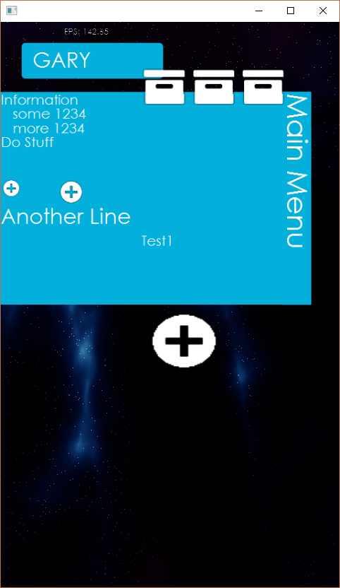

byt3d
=====

## byt3d cross platform engine

***See the [changelog] for what's new in the most recent release.***

Currently available in formats for (cf [screenshots](#screenshots) below):

### Features
*  **Sample**

### Usage

* **How to use**

### Other Applications

*   **UFO** 
